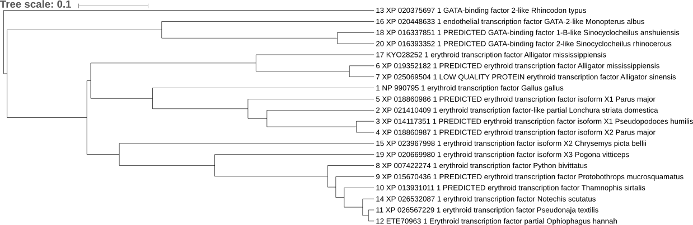

---
title: 'EEOB563 -- Assignment #2'
author: "Dennis Psaroudakis"
date: "January 26th 2019"
output:
  pdf_document:
    dev: pdf
    latex_engine: lualatex
    md_extensions: +link_attributes+multiline_tables
    pandoc_args: --listings
mainfontoptions: Numbers=OldStyle
monofont: Linux Libertine Mono O
mainfont: Linux Libertine O
papersize: letter
sansfont: Linux Biolinum O
language: en-US
...

## 3
GitHub repo is https://github.com/Thyra/EEOB563

## 4
a) The dinosaur sequence is highly similar to the cloning vector pAgaL as well as some other cloning vectors.
b) The highest rated sequence is erythroid transcription factor from *Gallus gallus*. It is only 96% identical, there are some differences:
```
Query  121   MEFVALGGPDAGSPTPFPDeagaflglgggerteaggllaSYPPSGRVSLVPWADTGTLG  300
             MEFVALGGPDAGSPTPFPDEAGAFLGLGGGERTEAGGLLASYPPSGRVSLVPWADTGTLG
Sbjct  1     MEFVALGGPDAGSPTPFPDEAGAFLGLGGGERTEAGGLLASYPPSGRVSLVPWADTGTLG  60

Query  301   TPQWVPPATQMEPPHYLEllqpprgspphpssgpllplssgpppCEARECVMARKNCGAT  480
             TPQWVPPATQMEPPHYLELLQPPRGSPPHPSSGPLLPLSSGPPPCEARECV    NCGAT
Sbjct  61    TPQWVPPATQMEPPHYLELLQPPRGSPPHPSSGPLLPLSSGPPPCEARECV----NCGAT  116

Query  481   ATPLWRRDGTGHYLCNWASACGLYHRLNGQNRPLIRPKKRLLVSKRAGTVCSHERENCQT  660
             ATPLWRRDGTGHYLCN   ACGLYHRLNGQNRPLIRPKKRLLVSKRAGTVCS    NCQT
Sbjct  117   ATPLWRRDGTGHYLCN---ACGLYHRLNGQNRPLIRPKKRLLVSKRAGTVCS----NCQT  169

Query  661   STTTLWRRSPMGDPVCNNIHACGLYYKLHQVNRPLTMRKDGIQTRNRKVsskgkkrrppg  840
             STTTLWRRSPMGDPVCN   ACGLYYKLHQVNRPLTMRKDGIQTRNRKVSSKGKKRRPPG
Sbjct  170   STTTLWRRSPMGDPVCN---ACGLYYKLHQVNRPLTMRKDGIQTRNRKVSSKGKKRRPPG  226

Query  841   ggnpsatagggapmggggdpsmpppppppaaappQSDALYALGPVVLSGHFLPfgnsggf  1020
             GGNPSATAGGGAPMGGGGDPSMPPPPPPPAAAPPQSDALYALGPVVLSGHFLPFGNSGGF
Sbjct  227   GGNPSATAGGGAPMGGGGDPSMPPPPPPPAAAPPQSDALYALGPVVLSGHFLPFGNSGGF  286

Query  1021  fgggaggYTAPPGLSPQI  1074
             FGGGAGGYTAPPGLSPQI
Sbjct  287   FGGGAGGYTAPPGLSPQI  304
```

## 5
These sequences might be homologous (I don't think I can be 100% sure just from the blast result) and if they are, they are more specificially orthologous because they are in different species as opposed to in different genome locations within the same species.

## 6
I let mafft choose the strategy (auto) and it chose L-INS-i, probably because there were so few sequences and not too long.

{width=65%}}

This tree is a guide tree so it is only a rough clustering of the species, not the final phylogenic tree. The actual algorithm to create the phylogenetic tree is run later.
