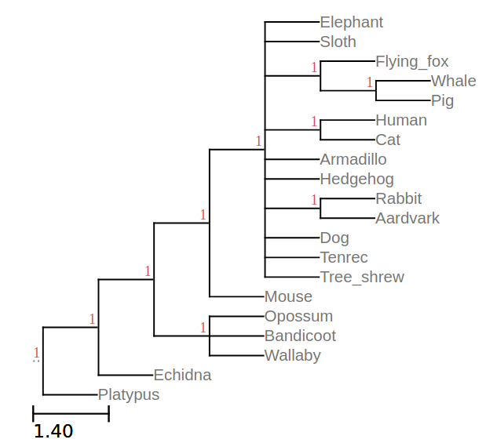
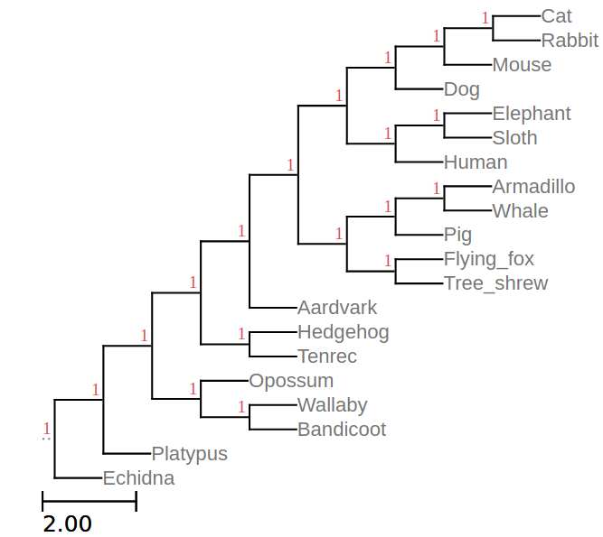
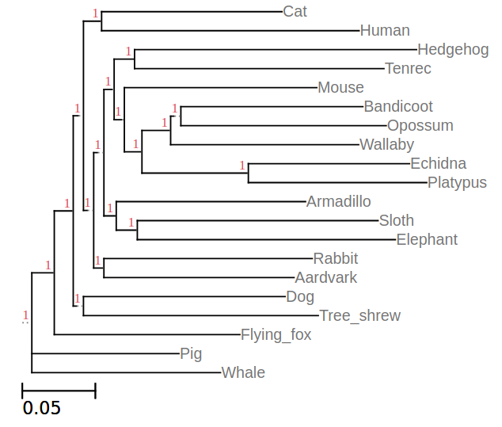
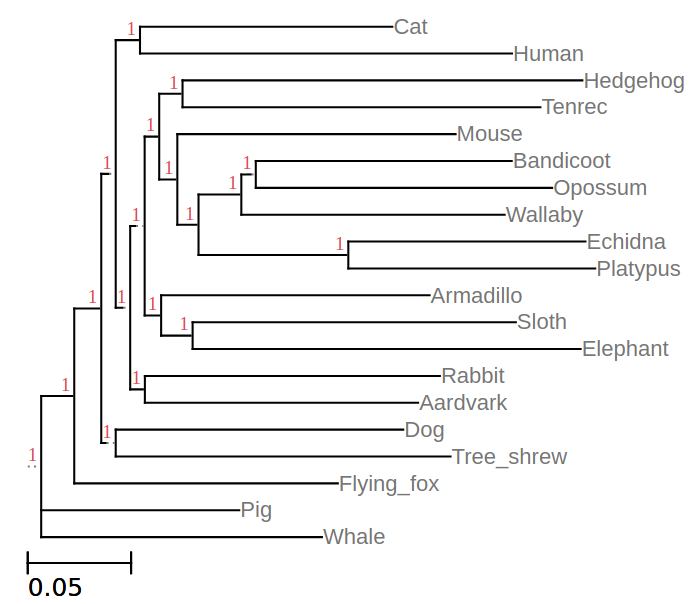

---
title: 'EEOB563 -- Assignment #4'
author: "Dennis Psaroudakis"
date: "February 27th 2019"
output:
  pdf_document:
    dev: pdf
    latex_engine: lualatex
    md_extensions: +link_attributes+multiline_tables
    pandoc_args: --listings --colorlinks
mainfontoptions: Numbers=OldStyle
monofont: Linux Libertine Mono O
mainfont: Linux Libertine O
papersize: letter
sansfont: Linux Biolinum O
language: en-US
titlepage: true
...

## 4.
The generated matrices and trees can be found [here](https://github.com/Thyra/EEOB563/tree/master/assignments/4/4). I chose Platypus (20) as the outgroup, this is the generated tree:

```
(((((Elephant,Sloth,(Flying_fox,(Whale,Pig),(Human,Cat),Armadillo,
Hedgehog,(Rabbit,Aardvark),Dog,Tenrec,Tree_shrew),Mouse),(Opossum,
Bandicoot,Wallaby),Echidna),Platypus);))))
```

{width=60%}

## 5.
I used the Jukes-Cantor distance model, just because I used it for Part I so I knew most about it. This is the generated consensus tree from all the bootstrapped alignments:

```
((((((((((Cat:1.00,Rabbit:1.00):1.00,Mouse:1.00):1.00,Dog:1.00):1.00,((Elephant:1.00,
Sloth:1.00):1.00,Human:1.00):1.00):1.00,(((Armadillo:1.00,Whale:1.00):1.00,Pig:1.00):1.00,
(Flying_fox:1.00,Tree_shrew:1.00):1.00):1.00):1.00,Aardvark:1.00):1.00,(Hedgehog:1.00,
Tenrec:1.00):1.00):1.00,(Opossum:1.00,(Wallaby:1.00,Bandicoot:1.00):1.00):1.00):1.00,
Platypus:1.00):1.00,Echidna:1.00);
```

{width=60%}

## 8.
Again, I used the Jukes-Cantor matrix. In my case, the two trees basically were the same, only the distances were slightly different:

Without NNI/SPR:
```
(((((Cat:0.114165981250,Human:0.162999018750):0.010559694336,((((Hedgehog:0.178496817708,Tenrec:0.157865182292):0.012008114955,(Mouse:0.121806644097,(((Bandicoot:0.115205470588,Opossum:0.129977529412):0.001976093750,Wallaby:0.119019406250):0.017233485577,(Echidna:0.102001583333,Platypus:0.112883416667):0.066429764423):0.010216355903):0.004562978795):0.005054285156,(Armadillo:0.119819296875,(Sloth:0.152378928571,Elephant:0.163353071429):0.012417703125):0.006888199219):0.002261122559,(Rabbit:0.131889476562,Aardvark:0.120376523438):0.005459932129):0.002273915039):0.003076952637,(Dog:0.127646692383,Tree_shrew:0.148635307617):0.001928684082):0.011074565918,Flying_fox:0.117479167614):0.013291332386,Pig:0.093116691667,Whale:0.119435308333);
```

With NNI/SPR:
```
(((((Cat:0.112028724609,Human:0.165136275391):0.009859859863,((((Hedgehog:0.177491945312,Tenrec:0.158870054687):0.009443020020,(Mouse:0.123529160645,(((Bandicoot:0.113613665527,Opossum:0.131569334473):0.004081156738,Wallaby:0.116914343262):0.018083876465,(Echidna:0.105270403320,Platypus:0.109614596680):0.065579373535):0.008493839355):0.007128073730):0.005542280762,(Armadillo:0.119178175781,(Sloth:0.143488730469,Elephant:0.172243269531):0.013058824219):0.006400203613):0.002117241699,(Rabbit:0.130965949219,Aardvark:0.121300050781):0.005603812988):0.002973749512):0.003076952637,(Dog:0.127646692383,Tree_shrew:0.148635307617):0.001928684082):0.011074565918,Flying_fox:0.117013964355):0.013756535645,Pig:0.087929280762,Whale:0.124622719238);
```
Left: Without NNI/SPR, right: with NNI/SPR

{width=45%} {width=45%}

I may have done something wrong, you can check my parameters and input [here](https://github.com/Thyra/EEOB563/tree/master/assignments/4/8).
