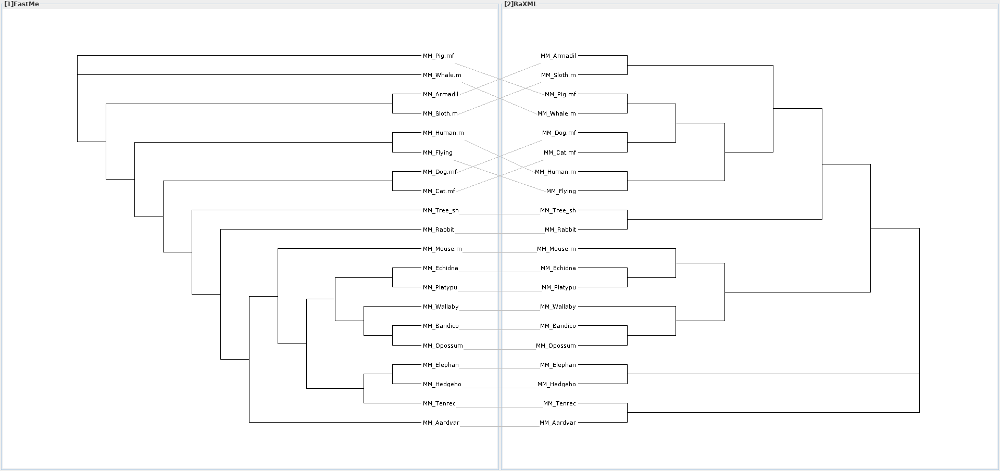
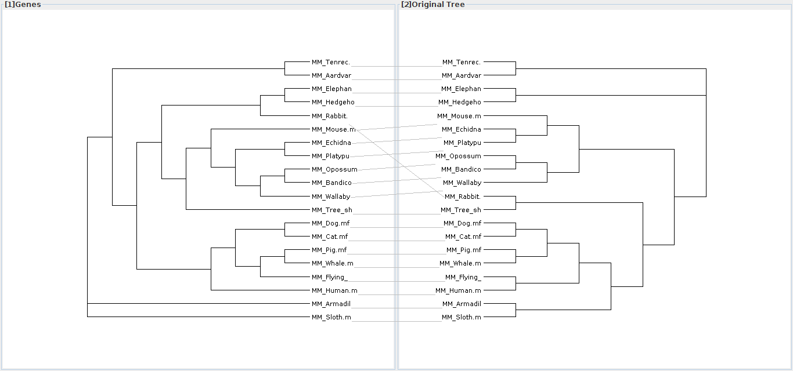

---
title: 'EEOB563 -- Assignment #5'
author: "Dennis Psaroudakis"
date: "March 12th 2019"
output:
  pdf_document:
    dev: pdf
    latex_engine: lualatex
    md_extensions: +link_attributes+multiline_tables
    pandoc_args: --listings
    template: ../template.tex
mainfontoptions: Numbers=OldStyle
monofont: Linux Libertine Mono O
mainfont: Linux Libertine O
papersize: letter
sansfont: Linux Biolinum O
language: en-US
titlepage: true
...

## 3
F84 is not available in raxml, so I'm using F81.
The trees are not the same (see following tanglegram), they also have different log-likelihood scores:

```
Raxml:  -54568.308901
FastMe: -54674.432495
```


\clearpage

## 4
These are the two commands I used:

```
raxml-ng --search --msa ../alignment.phy --model model_codons --prefix codons --seed 12 --brlen scaled
raxml-ng --search --msa ../alignment.phy --model model_genes --prefix genes --seed 12 --brlen scaled
```

The two models looked like this:

```
model_codons:
  GTR+G+FO, COBX=1-4482/3

model_genes:
  GTR+G+FO, cob=1-1248
  GTR+G+FO, cox1=1249-2808
  GTR+G+FO, cox2=2809-3543
  GTR+G+FO, cox3=3544-4482
```

These are the log-likelihoods for the best tree:

```
Codons: -45373.634679
Genes:  -45270.430490
```

They are much better than the original tree BUT the evolution models I used are different so I'm not sure if it's directly comparable.

Anyway, here is the difference between the Gene partitioned tree and the original RaXML tree, they are very similar except for the rabbit:



\clearpage

## 5
I had problems with slurm so I couldn't start it until Tuesday evening, so it's still running. I will resubmit this assignment tomorrow with part 5 when it is done. I am expecting a runtime of $\ge$ 10 hours from what the others have told me, I don't remember the runtimes from the lab anymore.
This is my slurm script:

```bash
#!/bin/bash

#SBATCH --time=10:30:00   # walltime limit (HH:MM:SS)
#SBATCH --nodes=1   # number of nodes
#SBATCH --ntasks-per-node=16   # 16 processor core(s) per node 
#SBATCH --job-name="5.5_assignment"
#SBATCH --mail-user=dpsaroud@iastate.edu   # email address
#SBATCH --mail-type=BEGIN
#SBATCH --mail-type=END
#SBATCH --mail-type=FAIL

# LOAD MODULES, INSERT CODE, AND RUN YOUR PROGRAMS HERE#!/bin/bash
cd /home/dpsaroud/EEOB563/assignments/5/5

/home/dpsaroud/bin/raxml-ng --all --msa ../alignment.phy --model GTR+G --seed 12 --threads 16 --bs-metric fbp --bs-trees 1000
```
